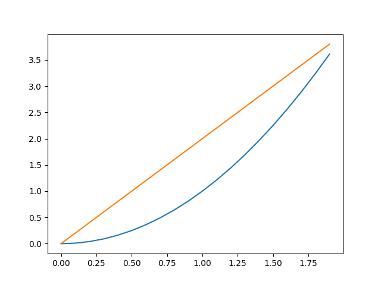

# IISE NumPy Workshop (3/11/2020)
## Requirements
To run NumPy code, you will need:
1. [Python](https://www.python.org/downloads/)
2. [NumPy](https://numpy.org/)
3. An editor (Python comes with IDLE but I recommend [VS Code](https://code.visualstudio.com/Download) with the [Python extension](https://marketplace.visualstudio.com/items?itemName=ms-python.python)). If you're already comfortable with a different editor thats fine too.

Files included in this repository that we will use:
1. `systems_check.py` - Run this script before the workshop to check if you have everything installed properly.
1. `outliers_skeleton.py` - Skeleton code for the project. We will fill this out during the workshop
1. `outliers.py` - A completed version of the outlier detection code, for your reference after the workshop.
1. `noisy_data.txt` - Sample data for the outlier detection project

## Setup
### Python setup
1. Download python (minimum version of 3.6) from the link above. In the installer, make sure you check the advanced option that says "add python to all environment variables"; otherwise, you won't be able to access it from the terminal. Alternatively, you can ad it to your PATH manually.
1. Open command prompt/powershell/OSX Terminal/your favorite shell and type `python --version`. Make sure the printed version is at least 3.6.
### NumPy setup
1. In the shell, type `python -m pip install --user numpy`. (NOTE: this is your command prompt or terminal window, NOT the python shell!)
1. To make sure its installed correctly, type `python -c "import numpy"`. It should execute without any output.
### Matplotlib setup
We will be using a graphing library called `matplotlib` in this workshop as well. This sometimes comes bundled with python installations, but if not, you can install it yourself pretty easily.
1. In the shell, type `python -m pip install --user matplotlib`. (Again, this is NOT the python shell).
1. Type `python -c "import matplotlib"` to make sure it installed correctly. You should not see any output.
### Workshop setup
1. Clone this repository (alternatively, download and unzip the `.zip` file) into a dedicated folder.
1. Open your editor of choice, navigate to this folder, and open the `systems_check.py` script.
1. If using VS Code, make sure you can run python scripts from within the environment by clicking the green triangle in the top right corner. In IDLE you can do this by going to the `Run...` menu and selecting `Run Module`, or by pressing `F5`.
1. Run the `systems_check.py` script. If it fails with any errors, make sure those are fixed before coming to the workshop. The output should be a picture like this: 
1. Make sure you can access the python REPL (shell). You can do this by going to your terminal/command prompt window and just typing `python`. You should see a few lines of output with the current python version, and then a prompt that looks like `>>>`. If the version is less than `3.6` you might have to type `python3` instead of `python`. Exit the REPL by typing `CTRL+Z` on a windows or `CTRL+D` on a mac/linux, or by typing `quit()` and pressing enter.

## About Me
My name is Raghav Malik. I completed my bachelors in Computer Engineering at Purdue in Spring 2019 and have returned to earn my PhD. My current research focus is applications of compiler optimization techniques to secure multiparty computation. I'm a member of PurPL (Purdue Programming Languages Group) and a research fellow under Milind Kulkarni. I have extensive experience in both python and NumPy from my undergraduate curriculum, previous internships, and current research. If you have any questions about this workshop, python in general, or my research, feel free to contact me at malik22@purdue.edu.